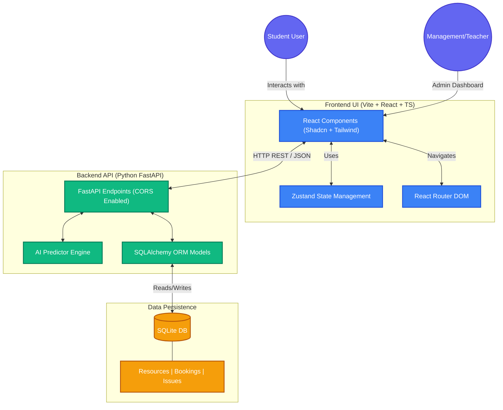

<div align="center">
  <h1>CAMPUS RESOURCE OPTIMIZER PROTOCOL [C.R.O.P]</h1>
  <h3><i>Smart Utilization of Shared Campus Infrastructure</i></h3>
</div>

<div align="center">
  <a href="https://postimg.cc/q62VXcvF">
    
  </a>
</div>

---

## 1. PROJECT OVERVIEW
The **Campus Resource Optimizer Protocol [C.R.O.P]** is an integrated management system designed to address the critical challenges of resource allocation and infrastructure transparency within university environments. The platform facilitates the real-time tracking, prediction, and optimization of both spatial assets (such as laboratories and study rooms) and essential consumable resources (such as LPG and water supplies).

## 2. TEAM IDENTITY: VIBE CODERZ
<div align="center">

| Name | Role | Identification |
| :---: | :---: | :---: |
| **Nilay Gurdasani** | Backend Developer | 25BAI10563 |
| **Keshav Maheshwari** | Frontend Developer | 25BAI11223 |
| **Tarun Sengar** | Documentation & Database Management | 25BAI11119 |

</div>

## 3. PROBLEM ANALYSIS
Contemporary campus management often suffers from fragmented data and lack of centralized visibility, leading to several operational inefficiencies:

* **Critical Infrastructure Scarcity**: Geopolitical factors and extreme weather conditions have resulted in unpredictable shortages of **LPG cylinders** and **water supplies**, necessitating real-time level tracking.
* **Spatial Underutilization**: Libraries and study rooms experience extreme "ghost booking" or overcrowding, particularly during disparate examination schedules across different academic years.
* **Management Complexity**: New students often face significant confusion regarding resource availability and logistical coordination within the campus ecosystem.

## 4. PROPOSED SOLUTION
Our solution provides a unified digital library and resource manager where students and administrators can interact with campus infrastructure through a data-driven interface.

### Core Functionalities:
* **Unified Resource Listing**: A comprehensive directory of all campus assets, categorized by type and capacity.
* **Dynamic Availability Tracking**: Real-time status updates reflecting whether a resource is currently available, booked, or under maintenance.
* **Intelligent Booking System**: A conflict-resolution engine that validates time-window requests to prevent overlapping reservations.
* **Usage Insights Engine**: A predictive model that analyzes historical usage patterns to provide a **Busyness Score (0-100%)** for any given time-slot.

## 5. TECHNICAL ARCHITECTURE
The system utilizes a modular, scalable architecture to ensure high performance and low latency.


<div align="center">
  
### Tech Stack Details:
| Layer | Technology | Rationale |
| :--- | :--- | :--- |
| **Frontend** | **Vite + React (TypeScript)** | For fast, client-side rendered, highly responsive user interfaces. |
| **Styling** | **Tailwind CSS + Shadcn** | Utilizing a high-contrast, premium dark-mode aesthetic with accessible components. |
| **State Management** | **Zustand** | To handle role-switching and real-time UI state updates. |
| **Backend** | **Python (FastAPI)** | Chosen for high-speed performance and automated documentation. |
| **Database** | **SQLite (SQLAlchemy)** | For reliable relational data storage with minimal overhead. |

</div>

## 6. ROLE-BASED DIFFERENTIATION
The platform implements distinct visual and functional experiences based on the user's role:

* **Student View**: Optimized for individual productivity. Focuses on personal reservations, study room availability, and receiving high-level alerts regarding critical consumable shortages.
* **Management/Teacher View**: Optimized for administrative oversight. Provides granular data on resource levels (e.g., exact cylinder counts per hostel block), maintenance controls, and laboratory management.

## 7. API SPECIFICATIONS
The backend exposes several critical endpoints for frontend integration:

<div align="center">
  
| Method | Endpoint | Description |
| :--- | :--- | :--- |
| `GET` | `/resources` | Retrieves all spatial assets and their current occupancy status. |
| `POST` | `/book` | Validates and creates a new resource reservation. |
| `GET` | `/predict/{resource_id}` | Calculates the predicted congestion level for a specific resource. |
| `GET` | `/admin/dashboard` | Aggregates campus-wide metrics for administrative review. |
| `POST` | `/report-issue` | Logs an issue and auto-flags the resource for maintenance. |
| `POST` | `/admin/resources` | Allows Management to add new locations dynamically. |
| `PATCH`| `/admin/resource/{resource_id}/status` | Admin override to manually update resource status. |

</div>

## 8. INSTALLATION AND SETUP
To deploy the project locally, follow these standardized steps:

### Backend Configuration:
Navigate to the backend directory and start the server:
```bash
cd Backend
pip install fastapi uvicorn sqlalchemy python-dateutil
python main.py
```
*(The API documentation will be available at http://127.0.0.1:8000/docs)*

### Frontend Configuration:
Navigate to the frontend directory, install dependencies, and start the development server:
```bash
cd Frontend
npm install
npm run dev
```
